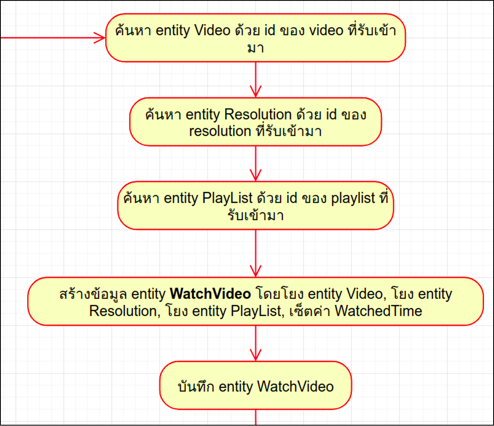
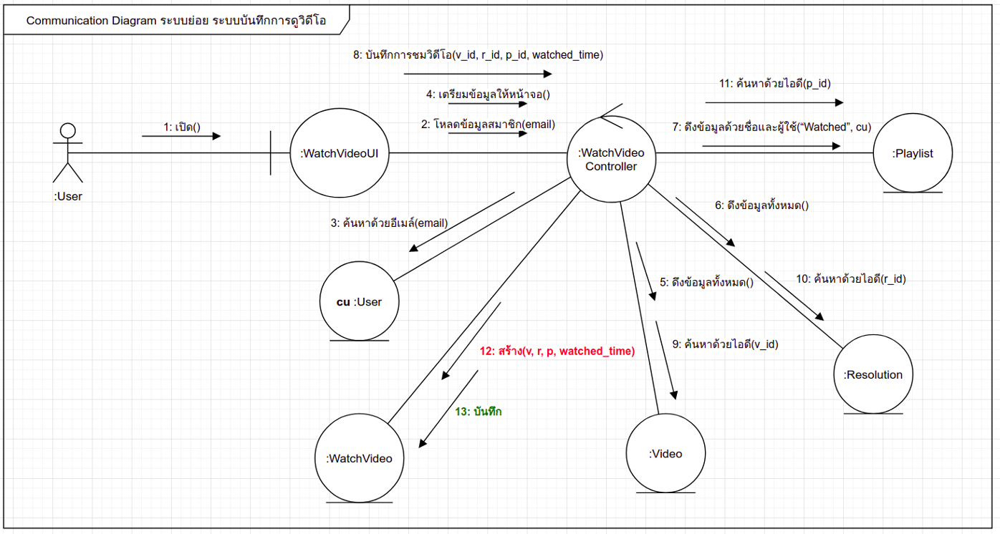

## ระบบบันทึกการดูวีดีโอ





อธิบาย Code ในส่วนของการ ค้นหา สร้าง โยง และบันทึก WatchVideo ตาม use case

```golang
// POST /watch_videos
func CreateWatchVideo(c *gin.Context) {

    var watchvideo entity.WatchVideo
    var resolution entity.Resolution
    var playlist entity.Playlist
    var video entity.Video

    // ผลลัพธ์ที่ได้จากขั้นตอนที่ 8 จะถูก bind เข้าตัวแปร watchVideo
    if err := c.ShouldBindJSON(&watchvideo); err != nil {
    	c.JSON(http.StatusBadRequest, gin.H{"error": err.Error()})
    	return
    }

    // 9: ค้นหา video ด้วย id
    if tx := entity.DB().Where("id = ?", watchvideo.VideoID).First(&video); tx.RowsAffected == 0 {
    	c.JSON(http.StatusBadRequest, gin.H{"error": "video not found"})
    	return
    }

    // 10: ค้นหา resolution ด้วย id
    if tx := entity.DB().Where("id = ?", watchvideo.ResolutionID).First(&resolution); tx.RowsAffected == 0 {
    	c.JSON(http.StatusBadRequest, gin.H{"error": "resolution not found"})
    	return
    }

    // 11: ค้นหา playlist ด้วย id
    if tx := entity.DB().Where("id = ?", watchvideo.PlaylistID).First(&playlist); tx.RowsAffected == 0 {
    	c.JSON(http.StatusBadRequest, gin.H{"error": "playlist not found"})
    	return
    }
    // 12: สร้าง WatchVideo
    wv := entity.WatchVideo{
    	Resolution:      resolution,            // โยงความสัมพันธ์กับ Entity Resolution
    	Video:             video,               // โยงความสัมพันธ์กับ Entity Video
    	Playlist:           playlist,           // โยงความสัมพันธ์กับ Entity Playlist
    	WatchedTime: watchvideo.WatchedTime,    // ตั้งค่าฟิลด์ watchedTime
    }

    // 13: บันทึก
    if err := entity.DB().Create(&wv).Error; err != nil {
    	c.JSON(http.StatusBadRequest, gin.H{"error": err.Error()})
    	return
    }
    c.JSON(http.StatusOK, gin.H{"data": wv})
}
```
